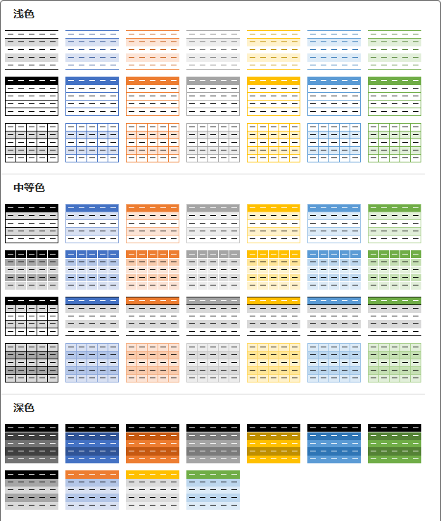

看群里有人求表格样式，我觉得这好像是非常简单的事情，然后决定弄一下，然后就弄了整整一天，就是把 Excel 自带的样式都给复刻了一遍。



## 使用方法

以下任选其一即可：

### CSS 片段

将 CSS 代码（后面会讲如何获取）放到 `.obsidian/snippets` 文件夹下，在 `设置——外观——CSS代码片段` 中启用，此方法全局生效。但只能选择一种样式使用。

### Dataview 视图 + Callouts

在需要使用此样式的笔记中插入如下代码段，代码段的语言设置为 `dataviewjs`（文档中为避免被错误的执行，均写为 js）

```js
dv.view('Table'， {mode: 'Callouts', style: 'Light-1-1'})
```

然后像这样在 Callouts 中插入表格即可，注意：Callouts 的类型和上面的 `style` 的值应该对应。

```markdown
> [!Table-Light-1-1]
>
> | 表格示例 |   第一列   |   第二列   |
> | :------: | :--------: | :--------: |
> |  第一行  | 一二三四五 | 可爱稻米鼠 |
> |  第二行  | 六七八九十 | 快给他投食 |
> |  第三行  | 喵喵喵喵喵 | 鼠鼠要撒娇 |
```

## 参数说明

Dataview 视图的属性和取值说明：

- `style`： 样式名称，按照上面图片，分为三组：`Light`、`Normal`、`Dark`，然后每组里的第几行，第几个，这样组合下来就成了 `Light-1-1` 的名称；
- `mode`：输出类型：
  - 默认，即不书写此属性，直接插入需要的样式，对所有表格生效（需要此段 dataview 代码处于加载状态）；
  - `callouts`：即上面示例方法，这样使用的好处是可以在一篇笔记中使用多个表格样式；
  - `examples`：输出所有表格样式，以供参考、选择，所以样式编号并不需要记忆；
  - `getStyle`：获取指定样式的 CSS 代码，可以复制之后加入 CSS 片段中，全局生效；
- `title`：在 `callouts` 模式下是否显示标题，默认是不显示 Callouts 的标题，如果设置为 1，则显示 Callouts 标题

## 样式修正

一些主题对表格样式有修改，需要自己写代码补偿回来。

我自己用 Minimal 主题，所以目录下有一份 `FixMinimal.css` 样式片段，如果你也使用此主题，可以将此内容加入 CSS 片段中。

## 代码下载

https://afdian.net/item/e808efe84f7a11ed86ec52540025c377