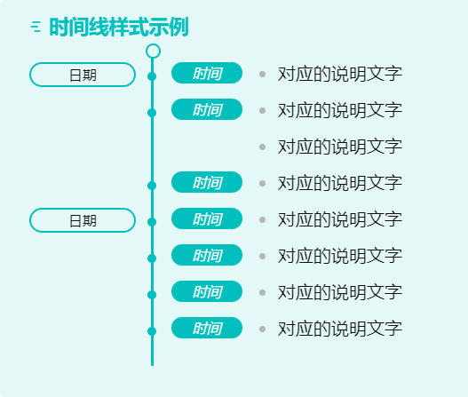

时间线显示，用来记录一些时间顺序的内容，当然也可自由发挥。

## 使用方法

以下任选其一即可：

### CSS 片段

将 `Style.css` 放到 `.obsidian/snippets` 文件夹下，在 `设置——外观——CSS代码片段` 中启用，此方法全局生效。

### Dataview 视图

在需要使用此样式的笔记中插入如下代码段，代码段的语言设置为 `dataviewjs`（文档中为避免被错误的执行，均写为 js）

```js
dv.view('Timeline')
```

## 使用示例

此样式针对 `timeline` 类型的 Callouts 生效，会让其中的无序列表以时间线格式显示，在每一项的开始可以有一条加粗内容，会显示在时间轴左侧，一条斜体内容，会显示在时间轴右侧，这两者均不是必须的。

先看效果：



再看对应的代码：

```markdown
> [!timeline] 时间线样式示例
> - **日期** *时间* 对应的说明文字
> - *时间* 对应的说明文字
> - 对应的说明文字
> - *时间* 对应的说明文字
> - **日期** *时间* 对应的说明文字
> - *时间* 对应的说明文字
> - *时间* 对应的说明文字
> - *时间* 对应的说明文字
```

## 代码下载

https://afdian.net/item/e808efe84f7a11ed86ec52540025c377