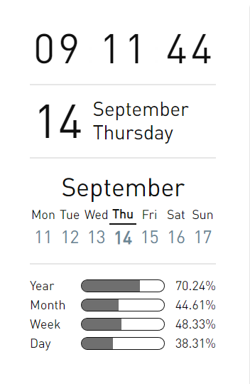

# Obsidian sidebar widgets.

Obsidian 的侧边栏小挂件，其实就是用 Dataview 插件写的一些功能组件（自定义视图），可以放在一篇笔记内，然后把这篇笔记拖到侧边栏，这样就有侧边栏小挂件啦~

也可以放在白板（canvas）中，优点是更自由的布局，缺点是移动端目前不支持，而且即便支持大概也很难用和电脑端相同的布局方案。

当然这些视图你也可以放在任意笔记中，比如大家都喜欢去装扮的入口笔记。

## 支持

如果这些东西对您有帮助，希望可以到我的爱发电——[https://afdian.net/item/e808efe84f7a11ed86ec52540025c377](https://afdian.net/item/e808efe84f7a11ed86ec52540025c377) 支持一下。这样才有动力更新下去啊。

（**付费后可以获得全部代码**）

## 使用

- 首先必须安装 [Dataview](https://github.com/blacksmithgu/obsidian-dataview) 插件，然后在设定中开启 `Enable JavaScript Queries`。
- 每个组件文件夹中的 README.md 文件中都写有详细的使用方法。
- 注意代码块的语言需设定为：`dataviewjs`（文档中为避免被错误的执行，均写为 js）
- **必须先插入前置组件 Base**
- 推荐每次更新完整覆盖，因为可能有一些细节上的关联修改。

## 细节

- 每个组件最好是独立的代码块
- 推荐关闭 Dataview 设置中的 `Automatic View Refreshing`，此设置旨在自动更新 Dataview 的查询结果，但在实际使用中，随着笔记的编辑，Dataview 的查询结果会不断刷新（闪烁）

## 效果预览

插件配色完全取决于主题配色，所以在不同主题下的颜色各有不同。

## 组件列表

- [Base](Base/) 前置组件，需在所有组件之前插入
- [Clock](Clock/) 数字时钟组件
- [Date](Date/) 日期、月份、星期组件
- [Week](Week/) 星期组件
- [Progress](Progress/) 时光进度组件
- [Task](Task/) 任务列表组件