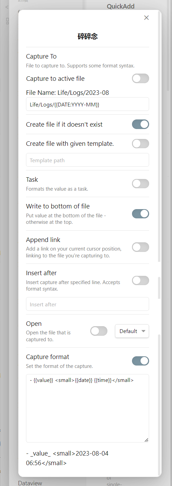
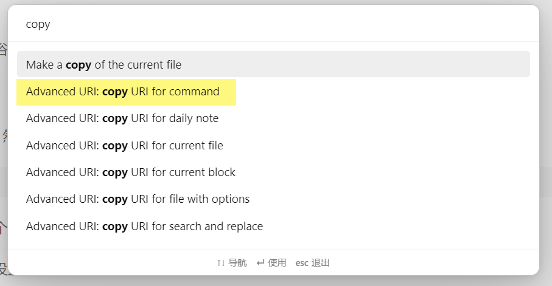

时不时地冒出一些想法，有点像浴室沉思那种，就想记录下来，希望能够尽可能地便捷。这个需求很类似闪念胶囊。

## 设定

用 QuickAdd 建立一个 Capture，然后如下设置：

因为预计量不大，所以设置为一个月一个文件，不过大概一年一个文件也完全 OK。

其他问题都不大，最后的格式，设置为了列表，并在最后用小字加上时间日期。

## 调用

在 QuickAdd 的操作列表中，点亮这个命令的小闪电，这样我们用 Ctrl+P 打开命令面板就可以搜到这条命令了。

在 `核心插件——命令面板` 中可以将此命令置顶。手机上可以在 `设置——移动端工具栏——快捷命令` 中设定此命令，这样在 Obsidian 中就可以下拉开始碎碎念了。

## 高级调用

安装 [Advanced URI](https://github.com/Vinzent03/obsidian-advanced-uri) 插件，然后在命令面板输入 `copy` 找到：`Advanced URI:copy URI for command`，就可以复制对应命令的链接，然后用其他工具通过这个链接快速调用了，比如在浏览器上建立一个书签。

选择这个命令之后接下来有两步操作：指定文件，选择命令。指定文件可以选择 `<Don't specify a file>`，即不指定某个文件。

然后手机上我用 KWGT 设定打开链接来实现这个操作，也可以用[快捷方式](https://kutt.appinn.com/Uu4Egk)或 [Anywhere-](https://github.com/zhaobozhen/Anywhere-) 实现。