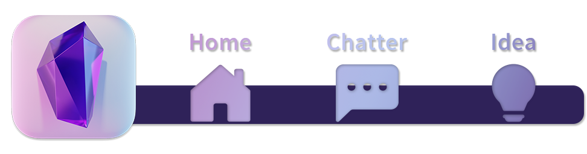
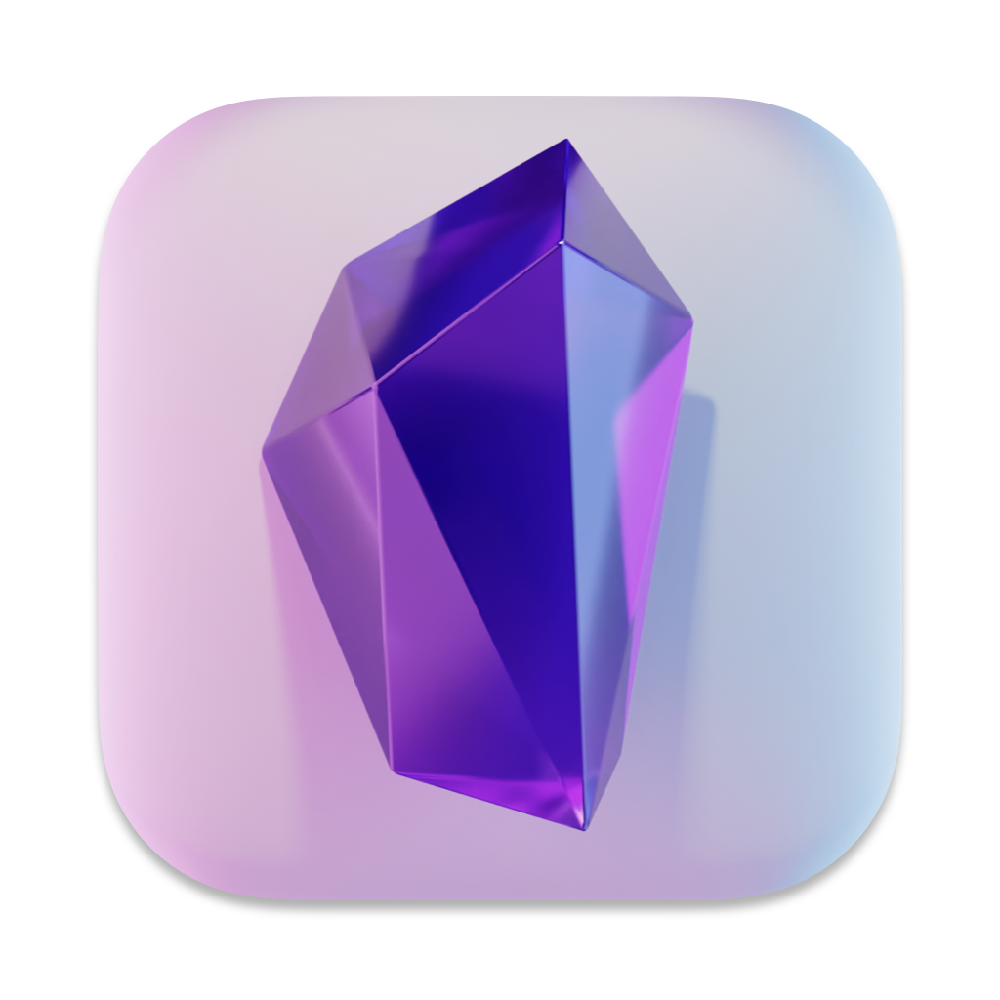

我在手机上用 [KWGT](https://play.google.com/store/apps/details?id=org.kustom.widget) 做了个小挂件，效果如下：

如果你想做，用上面的图片素材即可。

如果你想修改，抱歉，没有原文件提供，不过主要素材就是左侧的图标，来源：[https://www.reddit.com/r/ObsidianMD/comments/nc9uyc/yet_another_big_sur_icon_download_png_ico/](https://www.reddit.com/r/ObsidianMD/comments/nc9uyc/yet_another_big_sur_icon_download_png_ico/)。

图标备份：

后面三个操作的触发设定参见：[碎碎念](/Notes/0009_碎碎念.md?id=高级调用)