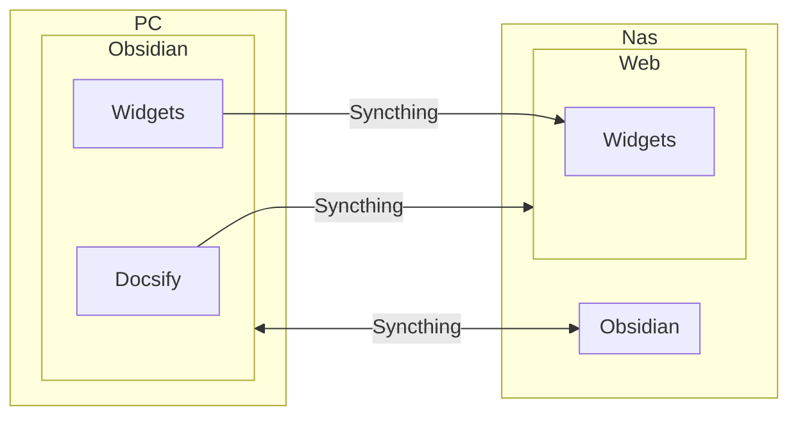

目前在用 Syncthing 实现 Obsidian 的同步，用的很舒服。详见 [文件同步流](/Workflow/FileSync.md)。

Docsify 是 Vault 中的的一个文件夹，额外同步到 Nas 上一个叫做 Web 的文件夹中，然后自动 git 提交、发布。

到这里流程很简单，但是我想把我写的 Dataview 小挂件也合并进来一起发布。但是小挂件的代码边写、边用、边改，就不适合放在 Docsify 的目录下，当然想发布的话又必须合并到其中……说着有点饶了，简单列表示意一下：

```
/
|-- Notes             .......... 笔记目录
|-- Dataview          .......... Dataview 相关代码目录
    |-- Widgets       .......... 想要发布的小挂件目录
|-- Docsify           .......... 发布的内容目录，对应 Nas 中的 Web 目录
    |-- Dataview      .......... Dataview 相关文章
        |-- Widgets   .......... 发布时期望小挂件目录在这里
```

注意上面最后一个 Widgets 目录在我的 Vault 中是不存在的。

然后我创建了如下同步流程：（如未显示图表，请刷新一下页面）



这里的重点是第二条线（Docsify --> Web）的同步中排除 Widgets 文件夹，仅在 Nas 端这边排除即可，因为只有这边 Web 目录中多出了这个文件夹。

如此实现了相对复杂的文件同步，再借助过滤，Widgets 的同步中排除了 js 和 css 文件，这样就只剩下说明文档被一同发布了。