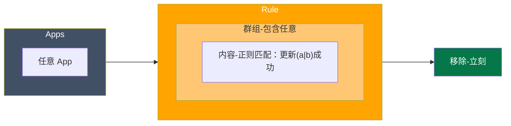
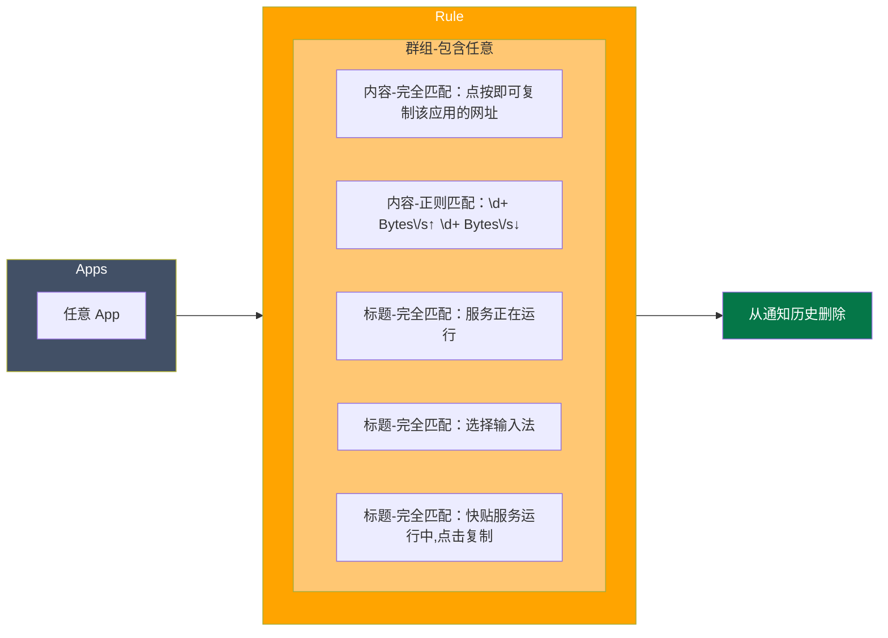
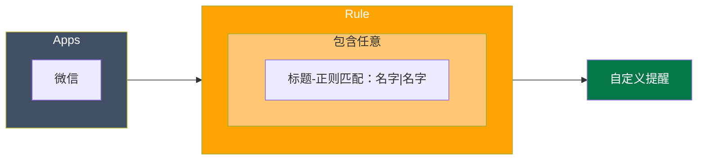

使用 [BuzzKill](https://play.google.com/store/apps/details?id=com.samruston.buzzkill) 进行处理，这里记录一下自己设定的规则，重点不在规则本身，而是处理思路。

我尽量将同类处理放在同一个规则中，这样可以做的限定相对会模糊，但是够用。

【显示不正常请刷新一下页面】

## 自动移除

## 无需记录

## 微信消息增强提醒

