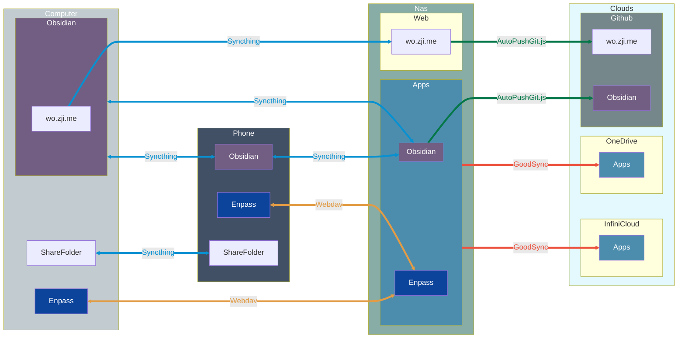

如果显示不正常，刷新一下页面就好了

```mermaid
flowchart LR
%% 笔记本电脑
subgraph NoteBook[Computer]
  subgraph NotObs[Obsidian]
    NotZJI[wo.zji.me]
  end
  NotShare[ShareFolder]
  NotEnpass[Enpass]
end
%% Nas
subgraph Nas[Nas]
  subgraph NasApps[Apps]
    subgraph NasObs[Obsidian]
    end
    NasEnpass[Enpass]
  end
  subgraph Web[Web]
    NasZJI[wo.zji.me]
  end
end
%% Clouds
subgraph Clouds[Clouds]
  subgraph OneDrive[OneDrive]
    OneApps[Apps]
  end
  subgraph InfiniCloud[InfiniCloud]
    InfApps[Apps]
  end
  subgraph Github[Github]
    GitObs[Obsidian]
    GitZJI[wo.zji.me]
  end
end
%% Phone
subgraph Phone[Phone]
  PhoObs[Obsidian]
  PhoEnpass[Enpass]
  PhoShare[ShareFolder]
end
%% 关系标注
NotObs <--->|Syncthing| NasObs
NotObs <--->|Syncthing| PhoObs
PhoObs <--->|Syncthing| NasObs

NotShare <--->|Syncthing| PhoShare

NotZJI --->|Syncthing| NasZJI

NasZJI --->|AutoPushGit.js| GitZJI
NasObs --->|AutoPushGit.js| GitObs

NotEnpass <--->|Webdav| NasEnpass
PhoEnpass <--->|Webdav| NasEnpass

NasApps --->|GoodSync| OneApps
NasApps --->|GoodSync| InfApps

%% 节点样式
style NoteBook fill:#c2ccd0,color:#FFF
style Nas fill:#88ada6,color:#FFF
style Clouds fill:#e3f9fd,color:#333
style Phone fill:#425066,color:#FFF
style Github fill:#75878a,color:#FFF

style NotObs fill:#725e82,color:#FFF
style NasObs fill:#725e82,color:#FFF
style PhoObs fill:#725e82,color:#FFF
style GitObs fill:#725e82,color:#FFF

style NotEnpass fill:#0d449b,color:#FFF
style NasEnpass fill:#0d449b,color:#FFF
style PhoEnpass fill:#0d449b,color:#FFF

style NasApps fill:#4c8dae,color:#FFF
style OneApps fill:#4c8dae,color:#FFF
style InfApps fill:#4c8dae,color:#FFF

%% Syncthing 线条
linkStyle 0 stroke:#0891d1,stroke-width:4px,color:#0891d1
linkStyle 1 stroke:#0891d1,stroke-width:4px,color:#0891d1
linkStyle 2 stroke:#0891d1,stroke-width:4px,color:#0891d1
linkStyle 3 stroke:#0891d1,stroke-width:4px,color:#0891d1
linkStyle 4 stroke:#0891d1,stroke-width:4px,color:#0891d1

%% AutoPushGit.js 线条
linkStyle 5 stroke:#057748,stroke-width:4px,color:#057748
linkStyle 6 stroke:#057748,stroke-width:4px,color:#057748

%% Webdav 线条
linkStyle 7 stroke:#e29c45,stroke-width:4px,color:#e29c45
linkStyle 8 stroke:#e29c45,stroke-width:4px,color:#e29c45

%% Webdav 线条
linkStyle 9 stroke:#ec513e,stroke-width:4px,color:#ec513e
linkStyle 10 stroke:#ec513e,stroke-width:4px,color:#ec513e
```