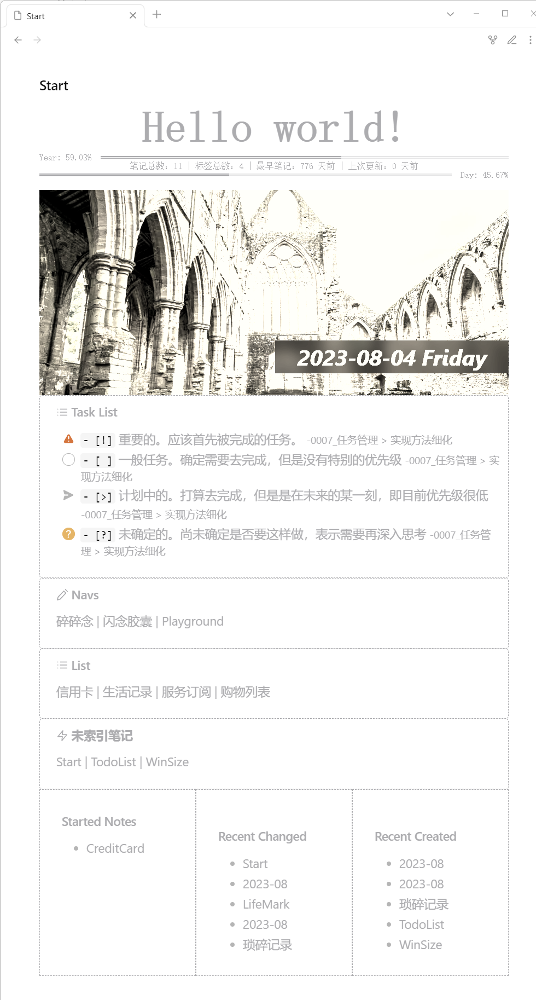

## 效果图



## 说明

按照自己的使用习惯和需求制作的，未特别考虑通用性，不过已经添加详细注释，可以按需修改

我的一些观点——[自由度](/Notes/0006_自由度.md)

## 代码

参见 [Dataview](/Snippets/Dataview/) 的使用方法。

我尽可能按功能拆分了模块，为得是便于大家按需选用，便于任意排序，也便于讲解注意事项。你也可以把自己选用的模块都放在一个代码块中。

### 样式模块

包含了所有模块的样式，如果用不上，可以删除对应代码，不过保留对性能影响不大。此模块不显示任何内容，建议和其他模块共用一个代码段，比较便于编辑。

```js
/* ==== 样式模块 ==== */
/* 为当前容器添加类，便于限定样式仅局部生效 */
dv.container.classList.add('Startpage-Main')
/* 注入模块样式 */
dv.container.innerHTML = `
<style>
  /* ==== 全局样式 ==== */
  /* 容器宽度限定，容器居中 */
  .Startpage-Main,
  .list-group {
    max-width: 800px;
    margin: 0 auto;
    --main-color: #ACACAF;
  }
  /* ==== 标题模块 ==== */
  /* 标题文字样式 */
  .Startpage-Main h1 {
    font-size: 4rem;
    font-weight: 700;
    font-family: serif;
    color: #ACACAF;
    margin: 0;
    text-align: center;
  }
  /* ==== 进度模块 ==== */
  /* 内容布局方案 */
  .Startpage-Main .progress-area {
    display: flex;
  }
  /* 文本样式 */
  .Startpage-Main .progress-area .progress-text {
    font-size: .8rem;
    line-height: 1em;
    height: 1em;
    font-family: monospace;
    color: #ACACAF;
    padding-right: 1em;
  }
  .Startpage-Main .day-progress .progress-text {
    padding-left: 1em;
    padding-right: 0;
  }
  /* 左侧进度条（已度过） */
  .Startpage-Main .progress-area .progress-pass {
    height: calc(.4rem + 2px);
    border-bottom: 4px double #ACACAF;
  }
  /* 右侧进度条（未度过） */
  .Startpage-Main .progress-area .progress-will {
    height: calc(.4rem + 2px);
    border-bottom: 4px double rgba(172, 172, 175, .3);
  }
  /* ==== 笔记统计模块 ==== */
  /* 内容文字样式 */
  .NoteStatistics{
    font-size: .8rem;
    line-height: 1em;
    height: 1em;
    font-family: monospace;
    color: #ACACAF;
    text-align: center;
  }
  /* 当宽度不足，隐藏部分细节 */
  @media screen and (max-width: 600px) {
    .NoteStatistics span.hide-when-narrow {
      display: none;
    }
  }
  /* ==== 海报模块 ==== */
  /* 图片容器 */
  .post-area {
    position: relative;
    background-size: cover;
    background-position: center;
    /* 亮度、对比度、灰度、 饱和度、深褐色 */
    filter: brightness(2) contrast(1.3) grayscale(.8) saturate(.6) sepia(.3);
    height: 300px;
    margin-top: 1rem;
  }
  /* 海报标题 */
  .post-area .post-title {
    position: absolute;
    bottom: 2rem;
    right: 0;
    padding: 0 2rem;
    font-size: 2rem;
    font-weight: 700;
    font-style: italic;
    background: rgba(0, 0, 0, .6);
    color: #DDDDE3;
    backdrop-filter: blur(10px);
  }
  /* 标题段落（为了在窄屏幕下）正确的折行 */
  .post-area .post-title>span {
    display: inline-block;
  }
  /* ==== 笔记列表模块 ==== */
  /* 内部整体容器，控制排列和上下边距 */
  .list-group {
    display: flex;
    flex-wrap: wrap;
  }
  /* 单个笔记列表模块 */
  .list-group .note-list {
    border: 1px dashed #ACACAF;
    color: #ACACAF;
    padding: 1rem 2rem;
    width: 33.33%;
  }
  /* 窄屏下并排数量 */
  @media screen and (max-width: 799px) {
    .list-group .note-list {
      width: 50%;
    }
  }
  @media screen and (max-width: 599px) {
    .list-group .note-list {
      width: 100%;
    }
  }
  /* 链接颜色 */
  .list-group a {
    color: #ACACAF;
  }
  /* ==== 任务列表 ==== */
  ul > li.task-list-item[data-task="x"], ul > li.task-list-item[data-task="X"] {
    color: #CFCFCF;
  }
  /* ==== 笔记索引 ==== */
  .callout {
    max-width: 800px;
    margin: 0 auto !important;
    background: none;
    border: 1px dashed #ACACAF;
  }
  .callout-icon .svg-icon,
  .callout-title-inner,
  .callout-title-inner a,
  .callout-content,
  .callout-content a {
    color: #ACACAF;
  }
  .callout-content mark {
    color: #ACACAF;
    background-color: rgba(255, 225, 0, 0.1);;
  }
  /* 隐藏块之间的换行 */
  .cm-line > br {
    display: none;
  }
</style>
`
```

### 标题模块

```js
/* ==== 标题模块 ==== */
/* 内容任意修改，没有使用 dv.header 方法是为了可以添加自定义类 */
dv.el('h1', 'Hello world!', {cls: 'Start-header'})
```

### 年/日进度模块

示例图中与笔记统计模块相结合，结合方式为先按显示顺序书写添加元素代码：

```js
/* ==== 元素插入 ==== */
/* 创建内容容器 */
const yearBar = dv.el('div', '', {cls: ['progress-area', 'year-progress']})
const NoteStatistics = dv.el('div', '', {cls: 'NoteStatistics'})
const dayBar  = dv.el('div', '', {cls: ['progress-area', 'day-progress']})
```

之后再书写各部分功能代码，这样就可以控制显示顺序了。当然这些代码要写在同一个代码段中。

之所以这样处理，是因为年进度和日进度相似代码很多，且都需要定时更新，所以合并到一起了。不太推荐拆分开，不过如果你只需要一个，可以删除另一个的 相关代码。

接续上方代码：

```js
/* ==== 进度模块 ==== */
/* 进度更新函数 */
const changeProgress = ()=>{
  /* 如果元素不存在则终止 */
  if(!yearBar || !dayBar) return
  /* 获取时间信息 */
  const now = new Date()
  const year = now.getFullYear()
  const yearStart = new Date(year, 0)
  const yearEnd = new Date(year+1, 0)
  /* 计算年进度 */
  const yearProgress = (now-yearStart)/(yearEnd-yearStart)
  const yearPass = (yearProgress).toFixed(2)
  /* 计算日进度 */
  const dayProgress = (now%864e5-now.getTimezoneOffset()*6e4)/864e5
  const dayPass = (dayProgress).toFixed(2)
  /* 生成代码 */
  yearBar.innerHTML = `
    <div class="progress-text">Year: ${(yearProgress*100).toFixed(2)}% </div>
    <div class="progress-pass" style="flex-grow: ${yearPass};"></div>
    <div class="progress-will" style="flex-grow: ${1-yearPass};"></div>`
  dayBar.innerHTML = `
    <div class="progress-pass" style="flex-grow: ${dayPass};"></div>
    <div class="progress-will" style="flex-grow: ${1-dayPass};"></div>
    <div class="progress-text">Day: ${(dayProgress*100).toFixed(2)}% </div>`
  /* 用以点击复制的分享文案 */
  yearBar.dataset.content = `YearProgress: ${''.padEnd(Math.round(yearProgress / 0.05), '▓')}${''.padEnd(Math.round((1 - yearProgress) / 0.05), '░')} ${(yearProgress*100).toFixed(2)}%`
  /* 定时进行下一次更新 */
  setTimeout(changeProgress, 6e4)
}
changeProgress()
/* 年进度复制 */
yearBar.onclick = ()=>{
  navigator.clipboard.writeText(yearBar.dataset.content)
}
```

点击年进度条可以复制如下格式的内容：`YearProgress: ▓▓▓▓▓▓▓▓▓▓▓▓░░░░░░░░ 59.02%`，以便到处分享，制造焦虑。日进度条没有，我觉得用不上，如果你有需求，自行添加即可，简单模仿一下对应代码。

### 笔记统计模块

如果按照上方所述，已经提前添加了元素，则下面代码中添加元素部分应当删除。注意：必须放在同一个代码段中，才可以使用前面定义的变量。

此部分是将所有笔记按照需求过滤并统计，然后存入对应变量，所以也是笔记列表模块的前置。这里使用了一个全局变量 `window.notes` 存储结果，以便复用。所以在笔记列表模块之后最好用 `delete window.notes` 消除影响。

笔记时间统计使用的是 FrontMatter 中的 `created` 和 `updated` 字段，我觉得这样比较准确，有不同需求可以自行修改。

```js
/* ==== 笔记统计模块 ==== */
/* 创建笔记统计元素 */
const NoteStatistics = dv.el('div', '', {cls: 'NoteStatistics'})
/** @type {number} 最近更新时间 */
let newestTime = 0
/** @type {number} 最早创建时间 */
let oldestTime = Date.now()
/* 笔记信息数组 */
window.notes = []
/* 遍历所有笔记 */
const pages = dv.pages().filter(e=>{
  /**
   * 判断文件类型和文件夹名称
   * 如果不是 md 后缀的不算笔记
   * 如果在 Resource 文件夹下的不算笔记
   * 这里用了正则，但是很简单，比如你可以把 Resource 换成任何顶层文件夹的名称
   */
  if(e.file.ext !== 'md' || /^(Resource|ZJI)/.test(e.file.folder)) {
    return false
  }
  /** @type {number} 如果有更早的创建时间则存储 */
  const createdTime = +new Date(e.file.frontmatter.created)
  /** @type {number} 如果有更晚的创建时间则存储 */
  const updatedTime = +new Date(e.file.frontmatter.updated)
  if(createdTime<oldestTime) oldestTime = createdTime
  if(updatedTime>newestTime) newestTime = updatedTime
  /* 摘取必要信息存入笔记数组 */
  window.notes.push({
    name: e.file.name,
    link: e.file.link,
    tags: e.file.tags,
    /* 关于时间，优先使用 FrontMatter 中的特定字段，如不存在，则使用系统数据（不准确，可能因同步等因素而被设定为错误的值） */
    created: new Date(e.file?.frontmatter?.created || e.file?.ctime?.ts),
    updated: new Date(e.file?.frontmatter?.updated || e.file?.mtime?.ts)
  })
  return true
})
/* 拼接代码输出 */
NoteStatistics.innerHTML = `笔记<span class="hide-when-narrow">总数</span>：${pages.length} |`
+`<span class="hide-when-narrow"> 标签总数：${dv.pages('').file.etags.distinct().length} |</span>`
+` 最早<span class="hide-when-narrow">笔记</span>：${Math.round((Date.now()-oldestTime)/864e5)} 天前 |`
+` 上次<span class="hide-when-narrow">更新</span>：${Math.round((Date.now()-newestTime)/864e5)} 天前`
```

### 海报模块

海报中日期并不会实时更新，应该也没啥必要。当前图片源是每日更新。图片增加了滤镜，更符合这种旧杂志的风格，可以在样式模块中自行调整。

```js
/* ==== 海报模块 ==== */
/* 创建元素 */
const topStory = dv.el('div', '', {cls: 'post-area'})
/* 获取星期几，觉得这里用英文好看一点 */
const dayName = ['Sunday', 'Monday', 'Tuesday', 'Wednesday', 'Thursday', 'Friday', 'Saturday'][new Date().getDay()]
/* 生成代码 */
/* 随机图片地址按需更换，我也没找到什么好用的，当前源是每日更新 */
topStory.style = `background-image: url('https://api.dujin.org/bing/1366.php?spam=${Date.now()}');`
topStory.innerHTML = `
  <div class="post-title"><span>${dv.func.dateformat(dv.date('now'), 'yyyy-MM-dd')}</span>&nbsp;<span>${dayName}</span></div>
`
```

### 任务列表模块

需要自行修改任务目录，或者将小括号留空（检索所有笔记）。具体任务标记请按照自己的需求进行修改。

```js
/* ==== 任务列表模块 ==== */
/* 读取所有任务，限定目录可以减少查询，提高性能 */
const allTasks = dv.pages('"Work"').file.tasks
/* 今日完成的任务 */
const todayDone = allTasks.filter(t=>t.completed && t.completion.ts===dv.date('today').ts)
/**
 * 输出任务列表组
 *
 * @param {string} title 列表标题（目前未使用，当注释了）
 * @param {number} count 列表最大任务数量
 * @param {array} taskList 经过排序/过滤的任务
 */
const TaskAddGroup = (title, count, taskList)=>{
  return taskList.slice(0, count).map(t=>`> - [${t.status}] ${t.text} <small>-${t.link}</small>\n`).join('')
}
/* 创建代码变量 */
let TaskCode = `> [!example] Task List\n`
/* 待办事项 */
TaskCode += TaskAddGroup('Next',  5, allTasks.filter(t=>t.status==='!'))
TaskCode += TaskAddGroup('Todo',  5, allTasks.filter(t=>t.status===' '))
TaskCode += TaskAddGroup('Plan',  5, allTasks.filter(t=>t.status==='>'))
TaskCode += TaskAddGroup('Maybe',  5, allTasks.filter(t=>t.status==='?'))
TaskCode += todayDone.length ? `> ---\n` : ''
TaskCode += TaskAddGroup('Done',  5, todayDone)
dv.el('div', TaskCode)
```

### 笔记列表模块

```js
/* ==== 笔记列表模块 ==== */
/* 创建元素 */
const NoteList = dv.el('div', '', {cls: ['list-group', 'note-groups']})
/**
 * 输出笔记列表组
 *
 * @param {string} title 列表标题
 * @param {number} count 笔记数量
 * @param {array} noteList 经过排序/过滤的笔记
 */
const noteAddGroup = (title, count, noteList)=>{
  /* 拼接笔记列表代码 */
  const listCode = noteList.slice(0, count).map(f=>`<li><a href="${f.link}">${f.name}</a></li>`).join('')
  /* 套用模板输出 */
  return `
  <div class="note-list">
    <h3>${title}</h3>
    <ul>
      ${listCode}
    </ul>
  </div>`
}
/* 星标笔记（包含 #stared 标签） */
NoteList.innerHTML += noteAddGroup('Started Notes',  5, window.notes.filter(n=>n.tags.includes('#stared')))
/* 最近更新 */
NoteList.innerHTML += noteAddGroup('Recent Changed', 5, window.notes.toSorted((a, b)=> -(a.updated-b.updated)))
/* 最近创建 */
NoteList.innerHTML += noteAddGroup('Recent Created', 5, window.notes.toSorted((a, b)=> -(a.created-b.created)))
/* 删除全局变量 */
delete window.notes
```

### 笔记索引模块

这部分比较简单，就是手写的 [Callouts](https://help.obsidian.md/Editing+and+formatting/Callouts)，其中有一些日期相关的内容，我用了 dataview 的 inline 查询：

```markdown
>[!note] Navs
> `$= '[[Life/Logs/'+dv.func.dateformat(dv.func.date('today'),  'yyyy-MM')+'|碎碎念]]'` | `$= '[[Inbox/Idea/'+dv.func.dateformat(dv.func.date('today'),  'yyyy-MM')+'|闪念胶囊]]'`  | [Playground](Inbox/Playground)
```

### 未索引笔记模块

自行修改需排除的文件夹，索引文件（文件夹）位置，均为正则表达式。

```js
/* 创建代码 */
const code = `> [!danger] 未索引笔记
> `
+ dv.pages().filter(p=>{
  // 排除这些文件夹中的笔记
  if(/^(ZJI|Resource|Life|Work|Inbox\/Idea)\//i.test(p.file.path)) return false
  // 没有进入链接的文件
  if(!p.file?.inlinks?.length) return true
  // 进入链接都不来自于索引文件（夹）
  let unIndex = true
  p.file.inlinks.forEach(l=>{
    if(/^Start/i.test(l.path)) unIndex = false
  })
  return unIndex
}).map(p=>p.file.link).join(' | ')
dv.el('div', code)
```